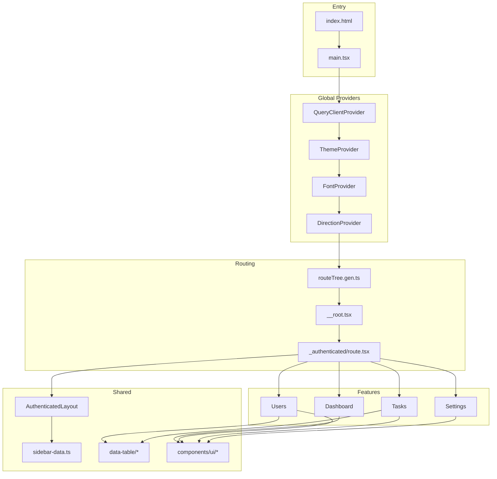

# Shadcn Admin — Project Overview

> Tài liệu này giúp **dev maintain** dự án và **người mới** hiểu cấu trúc, luồng hoạt động, cách mở rộng.

**Phiên bản:** 2.2.1  
**Loại dự án:** Admin dashboard UI showcase / reference — **không phải starter template production-ready**

---

## Mục lục

1. [Tổng quan nhanh](#1-tổng-quan-nhanh)
2. [Tech stack](#2-tech-stack)
3. [Cấu trúc thư mục](#3-cấu-trúc-thư-mục)
4. [Kiến trúc ứng dụng](#4-kiến-trúc-ứng-dụng)
5. [Routing (TanStack Router)](#5-routing-tanstack-router)
6. [State management](#6-state-management)
7. [Authentication](#7-authentication)
8. [Features (các module chính)](#8-features-các-module-chính)
9. [Components](#9-components)
10. [Styling & theming](#10-styling--theming)
11. [Testing](#11-testing)
12. [Scripts & workflow](#12-scripts--workflow)
13. [Hướng dẫn thêm page/feature mới](#13-hướng-dẫn-thêm-pagefeature-mới)
14. [Lưu ý khi maintain](#14-lưu-ý-khi-maintain)

---

## 1. Tổng quan nhanh

Shadcn Admin là bộ sưu tập UI dashboard tái sử dụng, xây trên **Shadcn UI + Vite + React 19**. Dự án demo hơn là starter:

| Đặc điểm | Chi tiết |
|----------|----------|
| Dữ liệu | Mock / Faker — không có backend thật |
| Auth custom | Giả lập login (delay 2s, set token mock) |
| Auth Clerk | Tích hợp thật, **tách biệt** dưới `/clerk/*` |
| Route `_authenticated` | Chỉ là **layout** (sidebar), **không chặn** người chưa login |
| React Query | Đã cấu hình global error handling, **chưa có** `useQuery`/`useMutation` thực tế |

**Luồng khởi động app:**

```
index.html
  └── main.tsx
        ├── QueryClientProvider   (React Query + xử lý lỗi 401/500)
        ├── ThemeProvider         (light/dark/system)
        ├── FontProvider          (inter/manrope/system)
        ├── DirectionProvider     (LTR/RTL)
        └── RouterProvider        (TanStack Router)
              └── routeTree.gen.ts (route tree tự sinh)
```

---

## 2. Tech stack

| Lớp | Công nghệ |
|-----|-----------|
| UI | [Shadcn UI](https://ui.shadcn.com) (Radix UI + Tailwind CSS v4) |
| Framework | React 19 |
| Build | Vite 8 |
| Routing | TanStack Router (file-based) |
| Table | TanStack Table |
| Server state | TanStack React Query (đã wire, chưa dùng API) |
| Client state | Zustand (auth) + React Context (theme, layout, …) |
| Form | React Hook Form + Zod |
| HTTP | Axios (chủ yếu cho error handling) |
| Auth (optional) | Clerk (`@clerk/react`) |
| Chart | Recharts |
| Test | Vitest 4 + Playwright (browser mode) |
| Lint/Format | ESLint 10 + Prettier |

**Alias import:** `@/` → `src/` (cấu hình trong `vite.config.ts` và `tsconfig`)

---

## 3. Cấu trúc thư mục

```
shadcn-admin/
├── public/                  # Static assets (favicon, images)
├── src/
│   ├── main.tsx             # Entry point — providers + router
│   ├── routeTree.gen.ts     # ⚠️ AUTO-GENERATED — không sửa tay
│   │
│   ├── routes/              # TanStack Router — chỉ định nghĩa route
│   ├── features/            # Business UI — page, form, table, mock data
│   ├── components/          # Shared components (layout, data-table, dialogs)
│   │   └── ui/              # Shadcn primitives (~30 components)
│   ├── context/             # React Context providers
│   ├── stores/              # Zustand stores
│   ├── hooks/               # Custom hooks tái sử dụng
│   ├── lib/                 # Utilities (cn, cookies, error handling)
│   ├── config/              # App config (fonts)
│   ├── assets/              # SVG icons, logos
│   ├── styles/              # Global CSS + design tokens
│   └── test-utils/          # Helpers cho test
│
├── components.json          # Shadcn CLI config
├── vite.config.ts           # Vite + Router plugin + Tailwind + Vitest
├── tsconfig*.json
├── .env.example             # VITE_CLERK_PUBLISHABLE_KEY
└── eslint.config.js
```

### Nguyên tắc tách layer

```
routes/     →  "Đường dẫn URL là gì?" (mỏng, ~5–15 dòng)
features/   →  "Trang hiển thị gì?" (toàn bộ UI logic)
components/ →  "Dùng chung giữa nhiều feature"
```

**Ví dụ:** Route `/users` chỉ import component `Users` từ `features/users/`:

```tsx
// src/routes/_authenticated/users/index.tsx
export const Route = createFileRoute('/_authenticated/users/')({
  validateSearch: usersSearchSchema,  // optional: sync URL ↔ table state
  component: Users,
})
```

---

## 4. Kiến trúc ứng dụng

### Provider tree

```tsx
// src/main.tsx
<QueryClientProvider>
  <ThemeProvider>
    <FontProvider>
      <DirectionProvider>
        <RouterProvider />
      </DirectionProvider>
    </FontProvider>
  </ThemeProvider>
</QueryClientProvider>
```

### Layout tree (trang authenticated)

```
__root.tsx
  ├── <Outlet />              # Child routes
  ├── <NavigationProgress />  # Top loading bar khi chuyển route
  └── <Toaster />             # Toast notifications (Sonner)

_authenticated/route.tsx
  └── AuthenticatedLayout
        ├── SearchProvider
        ├── LayoutProvider    # sidebar variant, collapsible
        ├── SidebarProvider
        ├── AppSidebar        # đọc sidebar-data.ts
        └── SidebarInset
              └── <Outlet />  # Feature page (Dashboard, Users, …)
```

### Pattern một feature page (authenticated)

Hầu hết page theo cùng một khung:

```tsx
// Ví dụ: src/features/users/index.tsx
export function Users() {
  return (
    <UsersProvider>           {/* State cho dialogs (optional) */}
      <Header fixed>
        <Search />
        <ThemeSwitch />
        <ConfigDrawer />
        <ProfileDropdown />
      </Header>

      <Main>
        {/* Page title + actions */}
        <UsersTable />
      </Main>

      <UsersDialogs />        {/* CRUD modals */}
    </UsersProvider>
  )
}
```

---

## 5. Routing (TanStack Router)

### Cách hoạt động

1. Plugin `@tanstack/router-plugin/vite` quét `src/routes/**` khi dev/build
2. Tự sinh `src/routeTree.gen.ts` — **không chỉnh sửa file này**
3. `main.tsx` import `routeTree` và tạo router

### Quy ước đặt tên file route

| Pattern | Ý nghĩa | Ví dụ URL |
|---------|---------|-----------|
| `index.tsx` | Index route | `/users` |
| `_authenticated/` | Layout route (không thêm segment URL) | — |
| `(auth)/` | Route group pathless | `/sign-in` (không có `/auth/` trong URL) |
| `(errors)/` | Error pages standalone | `/404`, `/500` |
| `$param.tsx` | Dynamic param | `/errors/unauthorized` |
| `clerk/` | Clerk auth subtree | `/clerk/sign-in` |

### Bản đồ routes

#### Trang chính (có sidebar)

| URL | Feature |
|-----|---------|
| `/` | Dashboard |
| `/tasks` | Tasks |
| `/apps` | Apps |
| `/chats` | Chats |
| `/users` | Users |
| `/help-center` | Coming Soon |
| `/settings` | Profile |
| `/settings/account` | Account |
| `/settings/appearance` | Appearance |
| `/settings/notifications` | Notifications |
| `/settings/display` | Display |
| `/errors/$error` | Error pages (unauthorized, forbidden, …) |

#### Auth (không sidebar)

| URL | Feature |
|-----|---------|
| `/sign-in` | Custom sign-in |
| `/sign-in-2` | Sign-in layout 2 cột |
| `/sign-up` | Custom sign-up |
| `/forgot-password` | Forgot password |
| `/otp` | OTP verification |

#### Error standalone

| URL | Mô tả |
|-----|-------|
| `/401` | Unauthorized |
| `/403` | Forbidden |
| `/404` | Not found |
| `/500` | Server error |
| `/503` | Maintenance |

#### Clerk (tách biệt)

| URL | Mô tả |
|-----|-------|
| `/clerk/sign-in` | Clerk SignIn |
| `/clerk/sign-up` | Clerk SignUp |
| `/clerk/user-management` | Users table (có guard `isSignedIn`) |

### URL search params (table state)

Các trang có bảng dữ liệu (Users, Tasks, Apps) đồng bộ filter/pagination lên URL qua Zod `validateSearch`:

```tsx
// Route file
const usersSearchSchema = z.object({
  page: z.number().optional().catch(1),
  pageSize: z.number().optional().catch(10),
  // filter, sort, ...
})

export const Route = createFileRoute('/_authenticated/users/')({
  validateSearch: usersSearchSchema,
  component: Users,
})
```

Feature đọc search params qua `getRouteApi`:

```tsx
const route = getRouteApi('/_authenticated/users/')
const search = route.useSearch()
const navigate = route.useNavigate()
```

Hook `useTableUrlState` (`src/hooks/use-table-url-state.ts`) giúp sync TanStack Table ↔ URL.

### Navigation type-safe

```tsx
import { Link } from '@tanstack/react-router'

<Link to="/users" search={{ page: 1 }}>Users</Link>
```

TypeScript biết chính xác route nào tồn tại nhờ `routeTree.gen.ts`.

---

## 6. State management

### Zustand — Auth store

**File:** `src/stores/auth-store.ts`

| Field / Method | Mô tả |
|----------------|-------|
| `user` | Thông tin user (in-memory) |
| `accessToken` | Token lưu cookie |
| `setUser`, `setAccessToken` | Set state |
| `reset` | Clear auth (dùng khi sign out / 401) |

Dùng bởi: sign-in form, sign-out dialog, QueryCache 401 handler.

### React Context — UI preferences

| Provider | File | State |
|----------|------|-------|
| `ThemeProvider` | `context/theme-provider.tsx` | `light` / `dark` / `system` |
| `FontProvider` | `context/font-provider.tsx` | `inter` / `manrope` / `system` |
| `DirectionProvider` | `context/direction-provider.tsx` | `ltr` / `rtl` |
| `LayoutProvider` | `context/layout-provider.tsx` | Sidebar variant, collapsible |
| `SearchProvider` | `context/search-provider.tsx` | Command menu open/close |

Tất cả persist qua **cookie** — user refresh vẫn giữ setting.

### Feature-level Context

| Provider | Feature | Quản lý |
|----------|---------|---------|
| `UsersProvider` | Users | Dialog state + row đang chọn |
| `TasksProvider` | Tasks | Dialog state + row đang chọn |

### React Query

Đã cấu hình trong `main.tsx`:

- **Queries:** staleTime 10s, không retry khi 401/403
- **Mutations:** global `onError` → `handleServerError`
- **QueryCache:** 401 → reset auth + redirect `/sign-in`; 500 → `/500` (prod only)

> **Lưu ý:** Chưa có API client hay `useQuery` thực tế. Khi tích hợp backend, thêm service layer và dùng pattern error handling đã có sẵn.

---

## 7. Authentication

Dự án có **2 hệ auth song song**, không ảnh hưởng lẫn nhau.

### Custom auth (mock)

```
/sign-in → user-auth-form.tsx
  ├── Delay 2s (giả lập API)
  ├── setUser + setAccessToken (mock)
  └── navigate → redirect param hoặc /
```

- **Không có guard** trên `_authenticated` routes
- Sign out: `sign-out-dialog.tsx` → `auth.reset()` → `/sign-in?redirect=...`
- Auth pages dùng `AuthLayout` (logo + form centered)

### Clerk auth (thật, optional)

```
/clerk/* → ClerkProvider (routes/clerk/route.tsx)
  ├── Cần VITE_CLERK_PUBLISHABLE_KEY trong .env
  ├── Thiếu key → hiện hướng dẫn setup
  └── /clerk/user-management → check isSignedIn, redirect nếu chưa login
```

**Xóa Clerk:** Xóa folder `src/routes/clerk/` và `src/features` liên quan Clerk — phần còn lại vẫn chạy bình thường.

### So sánh nhanh

| | Custom auth | Clerk |
|--|-------------|-------|
| URL | `/sign-in`, `/sign-up`, … | `/clerk/sign-in`, … |
| Thực sự bảo vệ route | ❌ | ✅ (user-management) |
| Cần API key | ❌ | ✅ |
| Mục đích | Demo UI form | Demo tích hợp Clerk |

---

## 8. Features (các module chính)

Mỗi feature nằm trong `src/features/{name}/`:

```
features/{name}/
├── index.tsx              # Page component (export chính)
├── components/            # UI riêng feature
│   ├── *-table.tsx
│   ├── *-columns.tsx
│   ├── *-dialogs.tsx
│   └── *-provider.tsx
└── data/
    ├── schema.ts          # Zod schema
    ├── data.ts            # Labels, options
    └── {name}.ts          # Mock data array
```

### Danh sách features

| Feature | Route | Mô tả |
|---------|-------|-------|
| **dashboard** | `/` | KPI cards, charts (Recharts), recent sales |
| **tasks** | `/tasks` | CRUD tasks, import, bulk delete, TanStack Table |
| **users** | `/users` | 500 users (Faker), invite/add/edit/delete dialogs |
| **apps** | `/apps` | Grid connected apps, filter/sort qua URL |
| **chats** | `/chats` | Split-pane chat UI, data từ JSON |
| **settings** | `/settings/*` | Nested layout: profile, account, appearance, notifications, display |
| **auth** | `/sign-in`, … | Sign-in, sign-up, forgot-password, OTP forms |
| **errors** | `/errors/$error`, `/404`, … | Reusable error page components |

### Data table pattern (Tasks, Users)

```
1. schema.ts     → Zod type cho entity
2. *.ts          → Mock data
3. *-columns.tsx → TanStack Table column definitions
4. *-table.tsx   → useReactTable + shared data-table components
5. Route         → validateSearch (Zod) cho URL state
6. *-provider.tsx→ Dialog open/close + selected row
7. *-dialogs.tsx → CRUD modal components
```

---

## 9. Components

### Layout (`components/layout/`)

| Component | Vai trò |
|-----------|---------|
| `AuthenticatedLayout` | Shell: sidebar + providers |
| `AppSidebar` | Sidebar navigation |
| `Header` | Top bar (sticky option) |
| `Main` | Content area (`fixed` / `fluid`) |
| `NavGroup`, `NavUser`, `TeamSwitcher` | Sidebar pieces |
| `data/sidebar-data.ts` | **Cấu hình menu** — sửa đây khi thêm nav item |

### Shared app components

| Component | Vai trò |
|-----------|---------|
| `command-menu.tsx` | Cmd+K global search |
| `config-drawer.tsx` | Settings: theme, font, RTL, sidebar layout |
| `theme-switch.tsx` | Toggle light/dark |
| `profile-dropdown.tsx` | User menu |
| `sign-out-dialog.tsx` | Confirm sign out |
| `navigation-progress.tsx` | Loading bar khi navigate |
| `confirm-dialog.tsx` | Reusable confirm modal |
| `data-table/*` | Pagination, toolbar, filters, bulk actions |

### UI primitives (`components/ui/`)

~30 Shadcn components. Thêm mới qua CLI:

```bash
npx shadcn@latest add button
```

**Components đã customize** (cẩn thận khi update qua CLI):

| Loại | Components |
|------|------------|
| Modified | `scroll-area`, `sonner`, `separator` |
| RTL updated | `alert-dialog`, `calendar`, `command`, `dialog`, `dropdown-menu`, `select`, `table`, `sheet`, `sidebar`, `switch` |

Chi tiết xem README.md.

---

## 10. Styling & theming

### Tailwind v4

Không có `tailwind.config.js`. Cấu hình qua CSS:

- `src/styles/index.css` — Tailwind entry + global styles
- `src/styles/theme.css` — Design tokens (oklch colors, sidebar vars)

### Theme system

| Setting | Provider | Cookie key |
|---------|----------|------------|
| Light/Dark/System | `ThemeProvider` | `vite-ui-theme` |
| Font | `FontProvider` | `font` |
| LTR/RTL | `DirectionProvider` | `dir` |
| Sidebar layout | `LayoutProvider` | (cookie trong provider) |

User thay đổi qua **ConfigDrawer** (góc header) hoặc **Settings → Appearance**.

### RTL support

- `DirectionProvider` set `dir` trên `<html>`
- Dùng logical CSS: `me-auto`, `inset-e-0`, …
- Nhiều Shadcn components đã chỉnh cho RTL

### Dark mode

Class-based: `.dark` trên `<html>`, không chỉ dựa `prefers-color-scheme`.

---

## 11. Testing

### Setup

- **Vitest 4** chạy trong **browser thật** (Playwright Chromium)
- Config trong `vite.config.ts` → block `test`
- Render qua `vitest-browser-react`

### Chạy test

```bash
# Cài browser lần đầu
pnpm test:browser:install

# Chạy tất cả
pnpm test

# Watch mode
pnpm test:watch

# UI mode
pnpm test:ui

# Coverage
pnpm test:coverage
```

### Pattern test

- File test co-located: `*.test.tsx` cạnh source
- Mock: `vi.mock()` cho stores, router
- `clearCookies()` trong `beforeEach` cho auth store tests
- `userEvent` + `render` từ `vitest-browser-react`

### Coverage exclude

`ui/`, `assets/`, `routes/`, `routeTree.gen.ts`, `test-utils/`

---

## 12. Scripts & workflow

```bash
# Development
pnpm dev              # Vite dev server (auto regen routeTree)

# Build
pnpm build            # tsc + vite build

# Quality
pnpm lint             # ESLint
pnpm format           # Prettier write
pnpm format:check     # Prettier check
pnpm knip             # Tìm unused exports/deps

# Test
pnpm test             # Vitest browser (headless)
pnpm test:watch
pnpm test:coverage
```

### CI pipeline (`.github/workflows/ci.yml`)

```
lint → format:check → playwright install → test → build
```

### Environment

```bash
# .env
VITE_CLERK_PUBLISHABLE_KEY=pk_test_...   # Chỉ cần nếu dùng Clerk
```

---

## 13. Hướng dẫn thêm page/feature mới

### Thêm trang authenticated (có sidebar)

**Bước 1 — Tạo feature module**

```
src/features/products/
├── index.tsx
├── components/
│   └── products-table.tsx
└── data/
    └── products.ts
```

```tsx
// src/features/products/index.tsx
import { Header } from '@/components/layout/header'
import { Main } from '@/components/layout/main'
import { Search } from '@/components/search'
import { ThemeSwitch } from '@/components/theme-switch'
import { ConfigDrawer } from '@/components/config-drawer'
import { ProfileDropdown } from '@/components/profile-dropdown'

export function Products() {
  return (
    <>
      <Header fixed>
        <Search className='me-auto' />
        <ThemeSwitch />
        <ConfigDrawer />
        <ProfileDropdown />
      </Header>
      <Main>
        <h2 className='text-2xl font-bold'>Products</h2>
        {/* Nội dung trang */}
      </Main>
    </>
  )
}
```

**Bước 2 — Tạo route file**

```tsx
// src/routes/_authenticated/products/index.tsx
import { createFileRoute } from '@tanstack/react-router'
import { Products } from '@/features/products'

export const Route = createFileRoute('/_authenticated/products/')({
  component: Products,
})
```

**Bước 3 — Thêm vào sidebar**

```ts
// src/components/layout/data/sidebar-data.ts
{
  title: 'Products',
  url: '/products',
  icon: Package,
}
```

**Bước 4 — Chạy dev** → `routeTree.gen.ts` tự cập nhật.

### Thêm trang auth (public)

```
src/features/auth/my-page/index.tsx   → UI + AuthLayout
src/routes/(auth)/my-page.tsx         → createFileRoute('/(auth)/my-page')
```

### Thêm trang có data table + URL state

1. Tạo Zod schema trong `data/schema.ts`
2. Route file thêm `validateSearch: zodSchema`
3. Feature dùng `getRouteApi` + `useTableUrlState`
4. Tham khảo `features/users/` hoặc `features/tasks/` làm mẫu

### Thêm Shadcn component

```bash
npx shadcn@latest add dialog
```

Component xuất hiện tại `src/components/ui/`. Config alias trong `components.json`.

---

## 14. Lưu ý khi maintain

### ⚠️ Điều quan trọng cần nhớ

1. **Không sửa `routeTree.gen.ts`** — file tự sinh, sẽ bị ghi đè
2. **`_authenticated` không phải auth guard** — muốn bảo vệ route, thêm `beforeLoad` check token
3. **Routes mỏng, features dày** — logic UI luôn ở `features/`, không nhét vào `routes/`
4. **Data đều mock** — khi production hóa, thay mock bằng API + React Query
5. **Clerk tách biệt** — có thể xóa mà không ảnh hưởng app chính
6. **Update Shadcn CLI** — kiểm tra danh sách customized components trước khi overwrite

### Checklist khi production hóa

- [ ] Thêm `beforeLoad` auth guard trên `_authenticated`
- [ ] Tạo API client layer (axios instance + interceptors)
- [ ] Thay mock data bằng `useQuery` / `useMutation`
- [ ] Cấu hình env variables thật
- [ ] Quyết định: custom auth hay Clerk (không cần cả hai)
- [ ] Review cookie keys và security

### File quan trọng — quick reference

| File | Khi nào cần sửa |
|------|-----------------|
| `src/main.tsx` | Thêm global provider, đổi QueryClient config |
| `src/routes/__root.tsx` | Root layout, devtools, error boundaries |
| `src/routes/_authenticated/route.tsx` | Thay đổi layout shell |
| `src/components/layout/data/sidebar-data.ts` | Thêm/sửa menu navigation |
| `src/stores/auth-store.ts` | Logic auth custom |
| `src/styles/theme.css` | Design tokens, màu sắc |
| `components.json` | Shadcn CLI settings |
| `vite.config.ts` | Alias, plugins, test config |

### Sơ đồ phụ thuộc tổng quan



---

## Đọc thêm

- [README.md](./README.md) — Features, sponsorship, customized Shadcn components
- [TanStack Router docs](https://tanstack.com/router/latest)
- [Shadcn UI docs](https://ui.shadcn.com)
- [TanStack Table docs](https://tanstack.com/table/latest)
